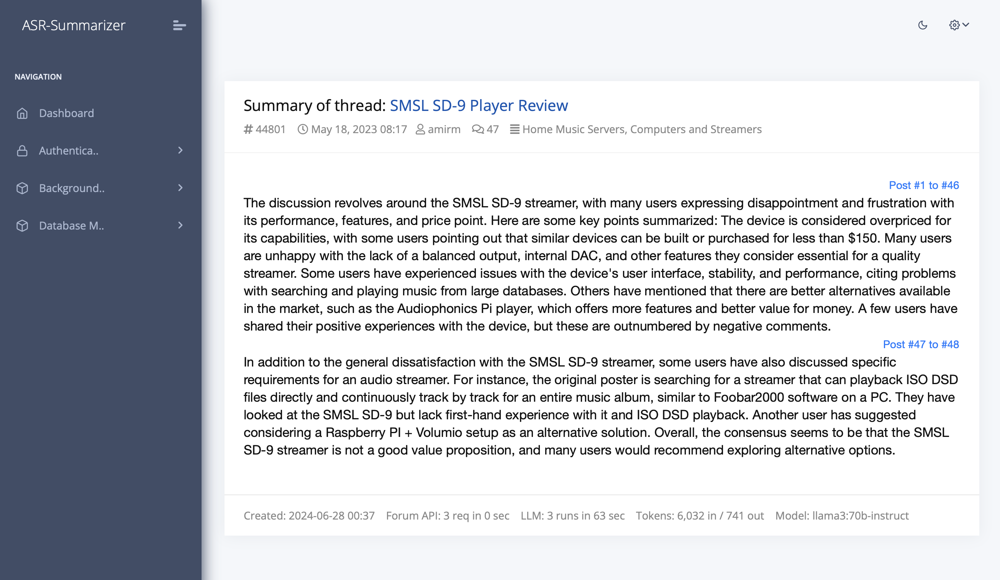
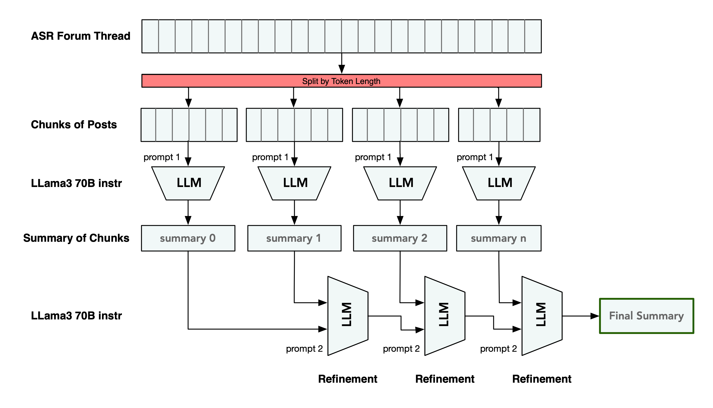
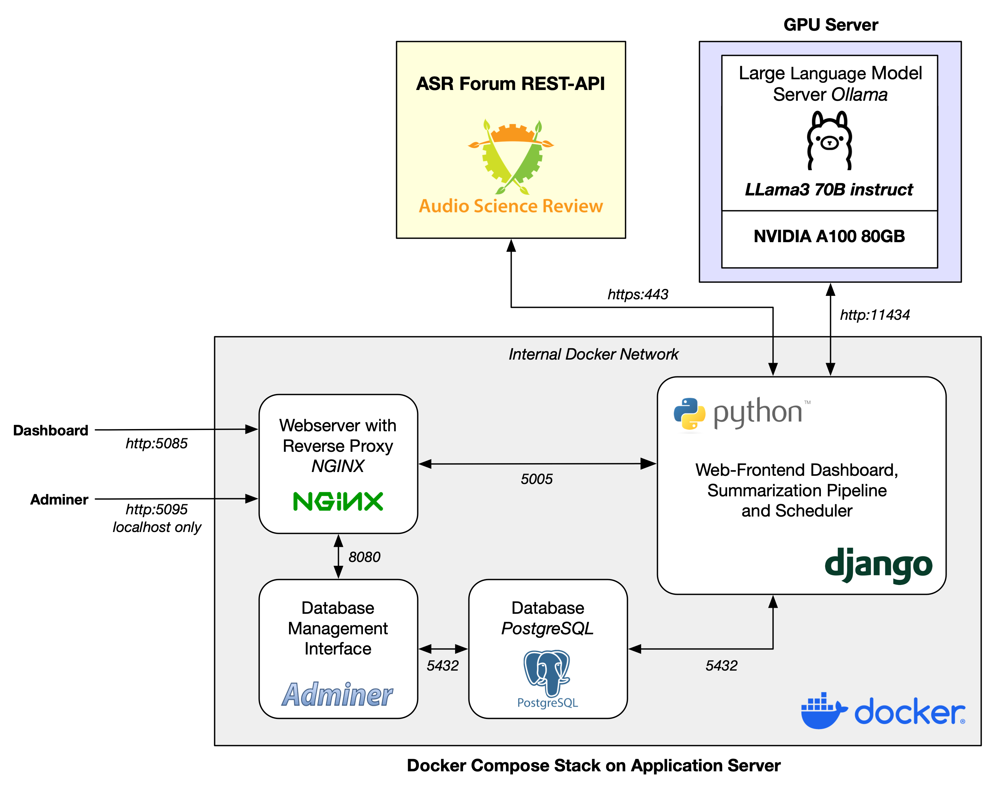

# ASR Thread Summary


*This document serves as a technical documentation of the project.*

## 1. Project Description
This project was developed as part of a master's degree course on deep learning in computer science. 
We developed an approach to summarize forum threads from the [Audio Science Review forum](https://www.audiosciencereview.com/) (ASR) with the use of **generative Artificial Intelligence**.

ASR forum threads are retrieved via the forum's REST-API, preprocessed and fed to a open-source Large Language Model in an iterative process to generate a summary. Finally, the approach was integrated into a web application.



### 1.1 Background 
The [Audio Science Review forum](https://www.audiosciencereview.com/) is an online community discussing the various aspects of audio equipment and science. Members can engage in detailed discussions, share their own experiences, and gain insights into audio technology and audio-related issues. The forum provides comprehensive reviews of various audio products, from amplifiers and digital-analog-converters to speakers and headphones, based on technical analysis. Most of the reviews are authored by the forum operator [Amir Majidimehr](https://www.audiosciencereview.com/forum/index.php?members/amirm.2/).  

The ASR forum currently comprises **more than 47,000 review and discussion threads** with a total of **over 1.95 million individual posts**. 
A high level of user interaction is characteristic for the forum and [individual threads](https://www.audiosciencereview.com/forum/index.php?threads/serious-question-how-can-dacs-have-a-sound-signature-if-they-measure-as-transparent-are-that-many-confused.9245/) can easily contain several hundred or even several thousand replies.
In this context, Amir has proposed the use of artificial intelligence to create summaries of ASR review threads and initiated a [discussion](https://www.audiosciencereview.com/forum/index.php?threads/using-ai-for-review-thread-summaries.52217/).


### 1.2 Summarization Approach
We have tested and evaluated different approaches for thread summarization in terms of quality, length, factual correctness and other aspects. Threads are summarized using LLMs as follows (see figure):

1. All posts for a ASR thread (given by thread ID) are fetched via the forum's REST-API
2. Loaded posts are preprocessed and cleaned from unwanted characters as well as HTML or forum-specific tags.
3. The thread is split into chunks of posts according to their token length. For this purpose, each post gets tokenized using the LLama 3 tokenizer model. The number of tokens is calculated per post.
4. Each chunk of posts is separately passed into the LLM to generate a single summary of the chunk. 
5. The summary of the first chunk, which covers the initial starting post of the thread, is passed into the LLM, together with the summary of the second chunk. The model is instructed to supplement the first summary with the content of the second summary, if it adds relevant information.
6. The summary generated in the previous step is again passed into the LLM with the summary of the next chunk, to extend and refine the overall summary. This step is repeated for all summaries of chunks until we obtain a final summary.



## 2. Project Structure
The project is structured as follows:
```bash
ASR-Thread-Summary
├── core
│   ├── settings.py               # Django settings file
│   └── ...
│
├── home                          # Dashboard application files and views
│
├── templates
│   ├── pages                     # Dashboard HTML template pages
│   └── ...
│
├── summarization                 # LLM summarization components 
│   ├── audio_science_review      # ASR forum and API access classes
│   ├── iterative_summarization
│   │   ├── prompts.py            # Prompt templates
│   │   ├── summarize.py          # Summarization approach
│   │   └── ...
│   ├── llama_tokenizer
│   ├── run_pipeline.py
│   ├── tasks.py
│   ├── thread_handling      
│   ├── tokenizer_models  
│   │   └── Meta-Llama-3-8B       # Tokenizer Model used for chunking of threads
│   └── ...
│
├── nginx
│   └── dashboard.conf            # NGINX configuration (HTTP/S server and reverse proxy)
│
├── start_task_scheduler.sh       # Start summarization background worker
├── Dockerfile                    # Dockerfile for dashboard container
├── build.sh                      # Build script for dashboard container
├── manage.py                     # Django command-line utility
├── docker-compose.yml            # Definition of project application stack
├── env.env                       # Project configuration file
├── ...
```

### 2.1 Services 

This project consists of multiple services and technologies that are defined in [docker-compose.yml](docker-compose.yml).




#### 2.1.1 Application (Dashboard)
The `dashboard` container operates the actual application. The build instructions for the image are defined in [Dockerfile](Dockerfile). 
It is a **Python 3.9** container in which the web frontend lives, implemented on top of the **Django** web framework.

In addition to the frontend server, the actual algorithm is run in the container as well as the communication with the forum API and an **Ollama** LLM server.
A worker process running in the background with a task queue (multi-threading) manages the generation of summaries and the LLM / forum requests.

The [summarization](summarization) directory contains all code and artifacts for our summarization approach. Our developed LLM prompts are defined in [summarization/iterative_summarization/prompts.py](summarization/iterative_summarization/prompts.py).

In [summarization/audio_science_review](summarization/audio_science_review) we implemented classes representing ASR forum entities and required methods for talking to the forum REST-API. 

#### 2.1.2 PostgreSQL Database
The `postgresql` container operates a **PostgreSQL** DBMS and holds database tables for summaries and the frontend sever.

#### 2.1.4 Adminer Database UI 
The `adminer` container operates **Adminer**, a tool for managing content in databases. We included it for development and debugging purposes. 
The container is optional and not necessary for operating the application.

#### 2.1.3 NGINX Reverse Proxy
The `nginx` container is a webserver and reverse proxy used to deliver the frontend. It forwards client requests to the dashboard application.
Additionally, it exposes the **Adminer** database web-interface, but allows requests only from *localhost* for security reasons.

### 2.2 Ports
The services in this project can be accessed via the following ports and urls:

| URL / Port              | Service                                                                                       |
|-------------------------|-----------------------------------------------------------------------------------------------|
| `http://<host>:5085`    | Dashboard web application                                                                     |
| `http://localhost:5095` | Adminer database web interface for development and debugging purposes (localhost access only) |


## 3. Required Resources

### 3.1 Forum REST-API Access

The ASR forum uses the community platform [XenForo (R)](https://xenforo.com) as a forum software. 
A built-in REST-API allows to programmatically interact with many areas of a XenForo installation.
There is no unauthenticated access to the API. To access the API, a key with sufficient permissions must be generated via the administration console.
More details on generating API keys are given in the corresponding [XenForo REST-API documentation](https://xenforo.com/docs/dev/rest-api/).

For this project, a key with granted **thread** and **node** (forum list) **read-permissions** is required.

Technically, this project should work with any XenForo-powered forum with a version greater than or equal to XenForo 2.1.

### 3.2 Ollama Server and pre-trained Large Language Model
This project uses a pre-trained open-source Large Language Modell for inference, deployed and served by an [*Ollama*](https://ollama.com) instance.
Ollama is a framework for building and running language models. It provides a simple API for running and managing models, as well as a library of pre-built models that can be easily used.

In this project, we use the following open-source large language model:
> llama3:70b-instruct

If you do not yet have Ollama running locally or on a server, follow the [documentation of the Ollama project](https://github.com/ollama/ollama/tree/main) to set up an instance.
Pull the model Llama3 70B from the Ollama model library:
```
ollama pull llama3:70b-instruct
```
Application and Ollama server do not have to run on the same machine.

We recommend the use of GPUs with graphics memory sufficient to load the large model. 
For this project we utilized an **NVIDIA A100 80GB** to performance capacity.

We used **Ollama version 0.1.42**. A decrease in performance and summary quality has been observed with newer versions. For this reason, we do not recommend using higher versions of Ollama at this time. Feel free to evaluate future versions, but keep an eye on summary length and quality.
> Ollama 0.1.42


## 4. Configuration
The configuration settings for the project and configurations for external resources are set via environment variables loaded into the container from [env.env](env.env). 
The following variables have to be set (see [env.env](env.env) for default and example values):

#### Forum API Settings
| Configuration Variable      | Description                                                                                                                                                          |
|-----------------------------|----------------------------------------------------------------------------------------------------------------------------------------------------------------------|
| `ASR_FORUM_API_URL`           | HTTP-URL of the forum REST API                                                                                                                                       |
| `ASR_FORUM_API_KEY`           | Secret key for API authentication with the required privileges                                                                                                       |
| `ASR_FORUM_TIMEOUT`           | Maximum timeout for requests to the forum REST API                                                                                                                   |
| `ASR_FORUM_DELAY`             | Waiting time between mass queries to the forum API (pagination)                                                                                                      |

#### Ollama Server and LLM Settings
| Configuration Variable      | Description                                                                                                                                                          |
|-----------------------------|----------------------------------------------------------------------------------------------------------------------------------------------------------------------|
| `OLLAMA_SERVER_URL`           | HTTP-URL and port to the Ollama LLM server instance                                                                                                                  |
| `OLLAMA_LARGE_LANGUAGE_MODEL` | Identifier / name of the model on the Ollama LLM server used for summarization                                                                                       |

#### Django Settings
| Configuration Variable      | Description                                                                                                                                                          |
|-----------------------------|----------------------------------------------------------------------------------------------------------------------------------------------------------------------|
| `SECRET_KEY`                  | Key used by Django for cryptographic signing. Replace an keep secret ([see Django docs](https://docs.djangoproject.com/en/5.0/ref/settings/#std-setting-SECRET_KEY)) |
| `DEBUG`                       | Turns on/off Django debug mode ([see Django docs](https://docs.djangoproject.com/en/5.0/ref/settings/#debug))                                                        |
| `CSRF_TRUSTED_ORIGIN`        | Host added to trusted origins for unsafe requests ([see Django docs](https://docs.djangoproject.com/en/5.0/ref/settings/#csrf-trusted-origins))                      |

Further configurations for Django can be set in the Django settings file [core/settings.py](core/settings.py) ([see Django docs](https://docs.djangoproject.com/en/5.0/ref/settings)).

#### NGINX Reverse Proxy Settings
Adjustments to the NGINX reverse proxy configuration such as TLS certificates or outward ports can be made in [nginx/dashboard.conf](nginx/dashboard.conf).

## 5. Setup and Deploy

### 5.1 Prerequisites

This repository contains a [docker-compose.yml](docker-compose.yml) which is used to build up all Docker images of this multi-container application. 
Docker installation is possible on various OS. Installation instructions can be found at https://docs.docker.com/install/

Please remember to adjust the configuration for the Ollama endpoint and the forum REST-API key.

### 5.2 Build Docker Images
Clone the repository and checkout the main/master branch.
```bash
$ git clone https://github.com/INF-HS-KL-BEGGEL/ASR-Tread-Summary.git 
```
Change into the top level directory of this project and build the Docker compose stack with: 
```bash
$ cd ASR-Tread-Summary
$ docker compose up  # Builds and runs container stack
```

### 5.3 Manually Starting and Stopping Application Stack
The already built application stack can be started manually (if not already started in the previous step):
```bash
$ docker compose start  # Starts application containers
```
Stopping the running application stack containers without removing them:
```bash
$ docker compose stop  # Stops application containers
```

### 5.4 Create Initial Superuser for Login
An initial superuser account has to be created to log in into the dashboard. Further accounts can be created later in the web-application by the superuser.

Start the container stack and run the following command. This command will prompt for a username and password for the new superuser account:
```bash
$ docker exec -it dashboard python manage.py createsuperuser  # create an admin user for login
```
### 5.5 Access Dashboard and Login
Open `http://localhost:5085` in a web-browser to access the dashboard (adjust host if necessary) and log in using the created superuser credentials (`http://localhost:5085/accounts/login/`):
> *Navigation > Sing In*


### 5.6 Assign a Thread for Summarizing

To assign an ASR forum thread for summarizing, a new thread entry has to be added in the dashboard (`http://localhost:5085/admin/home/summarizedthread/`).
> *Navigation > Database Management > Summarized Threads > Add Summarized Thread*

Only the **thread-ID** a has to be entered before saving the new entry. The thread is added to the queue and the worker automatically fetches all metadata and the content of the thread.
When processed, the summary is automatically added to the list of summarized threads.

The ID of a thread can be read very easily from a thread URL as its suffix:
>.../forum/index.php?threads/new-dutch-dutch-loudspeakers.**54977**

## 6. Authors
- Nico, [https://github.com/n-vent](https://github.com/n-vent)
- Fabian, [https://github.com/MatrixRave](https://github.com/MatrixRave)

## 7. Third Party Licences
The project uses third party dependencies. At least the following licenses must be complied with:

| Component          | License                                                                                                            |
|--------------------|--------------------------------------------------------------------------------------------------------------------|
| Meta Llama 3 Model | [LICENSE](summarization/tokenizer_models/Meta-Llama-3-8B/LICENSE)                                                  |
| Datta Able Django  | [LICENSE](LICENSE.md)                                                                                              |
| Nginx image        | [https://nginx.org/LICENSE](https://nginx.org/LICENSE)                                                             |
| PostgreSQL image   | [https://www.postgresql.org/about/licence/](https://www.postgresql.org/about/licence/)                             |
| Adminer image      | [https://github.com/vrana/adminer/blob/master/readme.txt](https://github.com/vrana/adminer/blob/master/readme.txt) |
| Python 3.9 image   | [https://docs.python.org/3/license.html](https://docs.python.org/3/license.html)                                   |
    

Legal note: *Built with Meta Llama 3*


